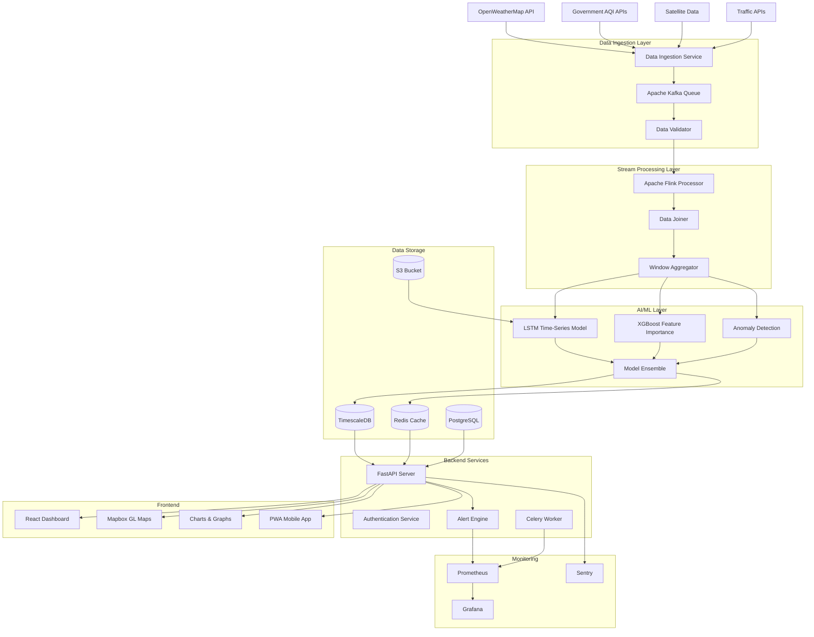
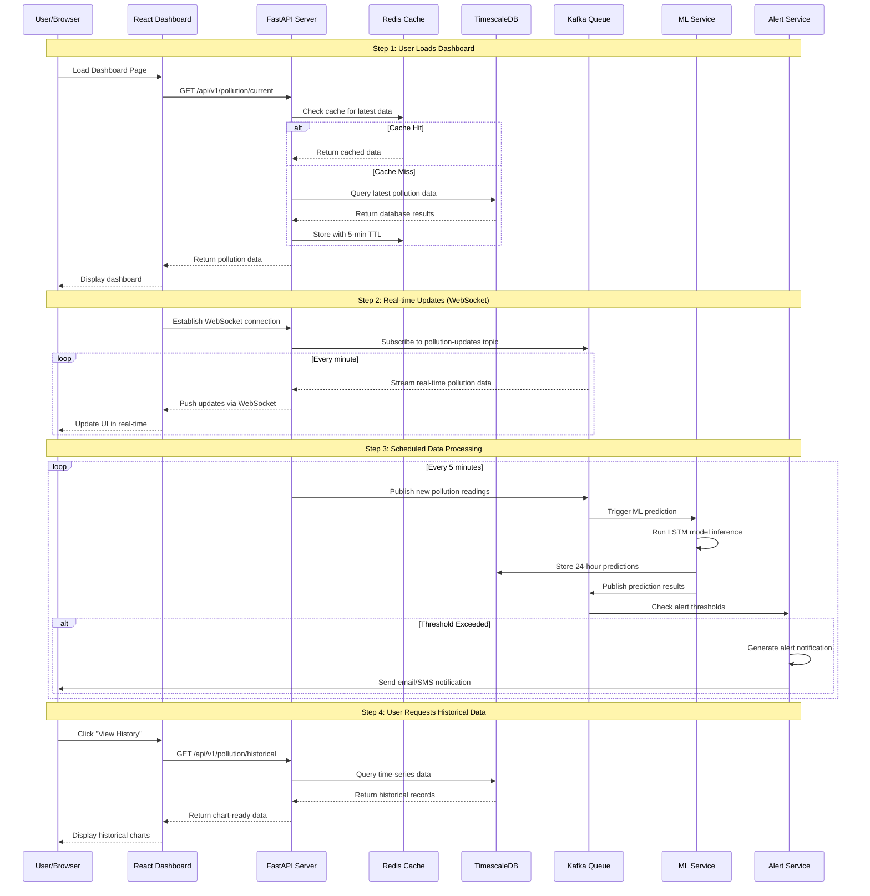

# 🌍 EcoGuard AI
### *Predicting Pollution Before It Happens*

## 🏆 Team AI Winner - Technothon: AI Battle Submission

**EcoGuard AI** is a real-time environmental pollution monitoring and prediction platform that forecasts air quality 24-48 hours in advance using artificial intelligence. Our system helps cities, organizations, and individuals take preventive action against pollution before it reaches dangerous levels.

---

## ✨ Features

### 🎯 **Real-time Pollution Monitoring**
- Live air quality data from 100+ cities worldwide
- Interactive heatmaps showing pollution hotspots
- Multi-parameter tracking (PM2.5, PM10, O3, NO2, SO2, CO)

### 🤖 **AI-Powered Predictions**
- **24-Hour Forecasts**: Accurate pollution predictions using LSTM neural networks
- **Source Attribution**: Identifies pollution sources (vehicles, industry, dust)
- **Anomaly Detection**: Flags sudden pollution spikes using Isolation Forest
- **Spatial Interpolation**: Predicts pollution between monitoring stations

### 🔔 **Smart Alert System**
- Personalized notifications for high pollution levels
- Health recommendations based on pollution severity
- Email, SMS, and push notification support
- Customizable alert thresholds

### 📊 **Comprehensive Dashboard**
- Interactive data visualizations
- Historical trend analysis
- Comparative city analysis
- Mobile-responsive design
- Exportable reports

### 🔧 **Developer-Friendly**
- RESTful API with comprehensive documentation
- Real-time WebSocket updates
- Open data access for research
- Docker containerization for easy deployment

---

## 🏗️ System Architecture

📊** Real-time Data Flow**

